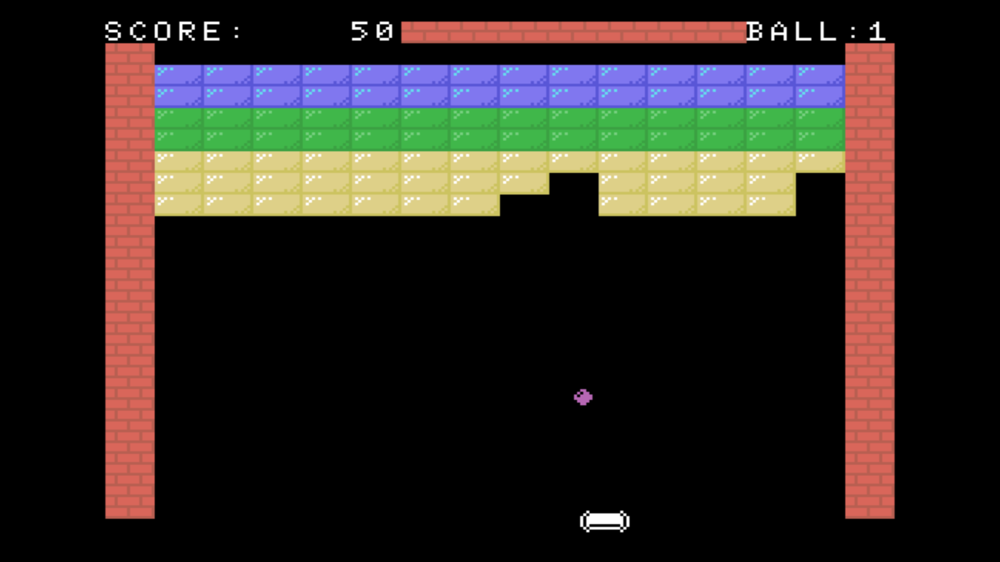

# msx-blockbreaker

## Overview

This is a simple block-busting game written in MSX-BASIC.

## Requirements

- MSX/2/2+/TurboR

## Run in WebMSX

- Please access the following URL.

https://webmsx.org/?MACHINE=MSX1J&DISKA_URL=https://github.com/aburi6800/msx-blockbreaker/raw/main/BLOCKBRK.dsk&FAST_BOOT

## How to play

- Space Key / A Button : Game Start
- Cursor Key / Control Pad : Paddle Move

## More Information

- Please refer to this [document](https://github.com/aburi6800/msx-blockbreaker/blob/main/documents/BLOCKBRK.pdf). (Japanese only)

- This program and other related files are licenshttps://github.com/aburi6800/msx-blockbreaker/blob/main/documents/BLOCKBRK.pdfed under terms of GPL (GNU General Public License). Changes, suggestions and improvement are welcomed.

